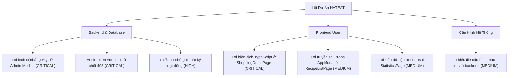

# BÁO CÁO PHÁT HIỆN LỖI DỰ ÁN (REPORT_BUG.MD)

Tài liệu này tổng hợp toàn bộ các lỗi và bất cập hệ thống được phát hiện trong quá trình kiểm thử toàn diện codebase của hệ thống **Convenient Grocery Shopping & Meal Planning (NATEAT)**.

---

## 1. PHÂN LOẠI MỨC ĐỘ NGHIÊM TRỌNG (SEVERITY LEVEL)

*   **CRITICAL (Nghiêm trọng)**: Lỗi gây chết luồng nghiệp vụ chính, lỗi biên dịch hệ thống (Compile error), lỗi bảo mật hoặc lỗi SQL khiến API hoàn toàn không khả dụng.
*   **HIGH (Cao)**: Lỗi logic nghiệp vụ khiến tính năng hoạt động không đúng thiết kế, hoặc mất tính đồng bộ dữ liệu giữa các bảng.
*   **MEDIUM (Trung bình)**: Lỗi trải nghiệm người dùng, cảnh báo TypeScript cần xử lý hoặc thiếu kết nối backend đối với một số tính năng phụ.
*   **LOW (Thấp)**: Lỗi hiển thị, giao diện lệch chuẩn hoặc cảnh báo không ảnh hưởng nhiều tới nghiệp vụ.

---

## 2. DANH SÁCH LỖI PHÁT HIỆN



---

### 2.1. BACKEND & DATABASE ISSUES

#### Lỗi 1: Lệch cấu trúc bảng & cột SQL giữa Admin Models và Database thực tế
*   **Mức độ nghiêm trọng**: 🔴 **CRITICAL**
*   **Thành phần ảnh hưởng**: Backend Admin Controllers/Models (`/api/admin/*`)
*   **Mô tả lỗi**:
    Các model phục vụ trang quản trị (`AdminRecipeModel`, `AdminFamilyModel`, `AdminStatsModel`, `AdminFoodModel`, `AdminSettingsController`) được viết dựa trên bản thiết kế thô trong `PROJECT_CONTEXT.md` chứ không dựa trên cấu trúc bảng thực tế của database được khai báo trong các model chính (`RecipeModel.js`, `ShoppingModel.js`, `FridgeItemModel.js`). Điều này gây ra lỗi SQL `column does not exist` hoặc `relation does not exist` khi gọi API.
*   **Các điểm lỗi cụ thể trong code**:
    1.  **Lỗi cột bảng `recipes`**:
        *   Trong [AdminRecipeModel.js](file:///c:/Users/KHANH/Documents/GitHub/Convenient-Grocery-Shopping-System/backend/src/models/AdminRecipeModel.js#L13-L25) và [AdminStatsModel.js](file:///c:/Users/KHANH/Documents/GitHub/Convenient-Grocery-Shopping-System/backend/src/models/AdminStatsModel.js#L19), SQL truy vấn các cột: `tieu_de`, `mo_ta`, `anh_url`, `thoi_gian`, `calo`, `do_kho`, `huong_dan`, `loai_quyen`, `gia_dinh_id`.
        *   Nhưng cấu trúc thực tế trong [RecipeModel.js](file:///c:/Users/KHANH/Documents/GitHub/Convenient-Grocery-Shopping-System/backend/src/models/RecipeModel.js#L183-L195) sử dụng các cột: `name_vi` (tiêu đề), `name_en`, `description` (mô tả), `instructions` (hướng dẫn), `prep_time` (thời gian chuẩn bị), `cook_time` (thời gian nấu), `servings` (khẩu phần), `is_public` (công khai - kiểu boolean). Bảng `recipes` không hề có cột `calo`, `do_kho` hay `gia_dinh_id`.
    2.  **Lỗi cột bảng `recipe_ingredients`**:
        *   Trong [AdminRecipeModel.js](file:///c:/Users/KHANH/Documents/GitHub/Convenient-Grocery-Shopping-System/backend/src/models/AdminRecipeModel.js#L42-L46) và [AdminFoodModel.js](file:///c:/Users/KHANH/Documents/GitHub/Convenient-Grocery-Shopping-System/backend/src/models/AdminFoodModel.js#L115-L121), SQL truy vấn `ri.food_id` và kết nối với bảng `foods` (`JOIN foods f ON f.id = ri.food_id`).
        *   Nhưng cấu trúc bảng thực tế trong [RecipeModel.js](file:///c:/Users/KHANH/Documents/GitHub/Convenient-Grocery-Shopping-System/backend/src/models/RecipeModel.js#L60-L65) chỉ lưu cột `name` (tên nguyên liệu kiểu chuỗi) chứ không liên kết khóa ngoại với `food_id`.
    3.  **Lỗi cột bảng `fridge_items`**:
        *   Trong [AdminFamilyModel.js](file:///c:/Users/KHANH/Documents/GitHub/Convenient-Grocery-Shopping-System/backend/src/models/AdminFamilyModel.js#L61) thực hiện `DELETE FROM fridge_items WHERE group_id = $1`.
        *   Nhưng cấu trúc bảng thực tế trong [FridgeItemModel.js](file:///c:/Users/KHANH/Documents/GitHub/Convenient-Grocery-Shopping-System/backend/src/models/FridgeItemModel.js#L78-L101) không hề có cột `group_id` hay `family_id`. Các mặt hàng trong tủ lạnh thuộc về cá nhân `user_id` và được nhóm theo gia đình bằng cách truy vấn danh sách thành viên trong nhóm trước.
    4.  **Lỗi cột bảng `shopping_lists`**:
        *   Trong [AdminFamilyModel.js](file:///c:/Users/KHANH/Documents/GitHub/Convenient-Grocery-Shopping-System/backend/src/models/AdminFamilyModel.js#L63-L68) dùng cột `family_group_id`.
        *   Nhưng thực tế trong [ShoppingModel.js](file:///c:/Users/KHANH/Documents/GitHub/Convenient-Grocery-Shopping-System/backend/src/models/ShoppingModel.js#L10) cột này tên là `group_id`.
    5.  **Lỗi cột bảng `meal_plans`**:
        *   Trong [AdminFamilyModel.js](file:///c:/Users/KHANH/Documents/GitHub/Convenient-Grocery-Shopping-System/backend/src/models/AdminFamilyModel.js#L69) thực hiện xóa bằng `family_group_id`.
        *   Nhưng thực tế bảng `meal_plans` trong [MealPlanModel.js](file:///c:/Users/KHANH/Documents/GitHub/Convenient-Grocery-Shopping-System/backend/src/models/MealPlanModel.js#L17-L26) chỉ lưu `user_id`, `start_date`, `end_date`, `status` và các bữa ăn chi tiết nằm ở bảng `meal_plan_items`. Bảng này không có cột `family_group_id`.
*   **Cách tái hiện**:
    Đăng nhập vào giao diện Admin, truy cập trang **Dashboard**, **Công thức (Recipes)** hoặc **Gia đình (Families)**. Các API `/api/admin/stats/summary`, `/api/admin/recipes` và hành động xóa gia đình sẽ lập tức trả về lỗi HTTP 500 kèm thông tin lỗi SQL từ DB.
*   **Hướng giải quyết**:
    Cập nhật lại toàn bộ các câu lệnh SQL trong thư mục `backend/src/models/Admin*` và `AdminSettingsController` để khớp chính xác với tên bảng và cột thực tế đang chạy ở Backend.

---

#### Lỗi 2: Trình xác thực mock-token Admin bị từ chối quyền truy cập (403 Forbidden)
*   **Mức độ nghiêm trọng**: 🔴 **CRITICAL**
*   **Thành phần ảnh hưởng**: Backend Authorization Middleware (`auth.js` & `adminRequired.js`)
*   **Mô tả lỗi**:
    Trang `frontend-admin` khi đăng nhập ở môi trường dev sẽ tạo ra mock token có định dạng `mock-token-{user_id}` (được định nghĩa trong [authStore.ts](file:///c:/Users/KHANH/Documents/GitHub/Convenient-Grocery-Shopping-System/frontend/frontend-admin/src/store/authStore.ts#L57)). Khi gửi token này lên backend, hàm `resolveMockUser(token)` trong [auth.js](file:///c:/Users/KHANH/Documents/GitHub/Convenient-Grocery-Shopping-System/backend/src/middleware/auth.js#L9-L26) chỉ trả về thông tin cơ bản của user nhưng **không gán trường `role`** cho object `user`.
    Khi đi qua middleware [adminRequired.js](file:///c:/Users/KHANH/Documents/GitHub/Convenient-Grocery-Shopping-System/backend/src/middleware/adminRequired.js#L14-L21), middleware này kiểm tra `req.user.role`. Do trường này bị thiếu (undefined), hệ thống sẽ đánh giá role không phải `'ADMIN'` và luôn trả về lỗi HTTP 403 Forbidden.
*   **Các điểm lỗi cụ thể trong code**:
    *   Hàm `resolveMockUser` trong [auth.js:L15-L23](file:///c:/Users/KHANH/Documents/GitHub/Convenient-Grocery-Shopping-System/backend/src/middleware/auth.js#L15-L23) thiếu thuộc tính `role: 'ADMIN'` hoặc lấy động từ database.
*   **Cách tái hiện**:
    1.  Mở trang Admin FE và đăng nhập bằng tài khoản Admin dev.
    2.  Gọi bất kỳ API nào thuộc group `/api/admin/*` (ví dụ: `GET /api/admin/users`).
    3.  Nhận phản hồi lỗi: `{"success": false, "message": "Quyền truy cập bị từ chối. Yêu cầu quyền quản trị viên."}`.
*   **Hướng giải quyết**:
    Thêm trường `role: 'ADMIN'` (hoặc truy vấn động trường `role` từ database dựa vào `user_id` đã được giải mã từ `mockId`) vào object trả về của hàm `resolveMockUser` trong file `backend/src/middleware/auth.js`.

---

#### Lỗi 3: Thiếu cơ chế ghi nhận hoạt động (Audit Activity Log System)
*   **Mức độ nghiêm trọng**: 🟠 **HIGH**
*   **Thành phần ảnh hưởng**: Backend & Database Log System
*   **Mô tả lỗi**:
    Hệ thống cung cấp API truy xuất nhật ký hoạt động gia đình `/api/admin/activities` thông qua `AdminActivityModel`. Tuy nhiên, trong toàn bộ các Express Controllers ở backend hiện tại, hàm ghi log [logActivity](file:///c:/Users/KHANH/Documents/GitHub/Convenient-Grocery-Shopping-System/backend/src/utils/logActivity.js#L14) **chưa từng được import và gọi** khi người dùng thực hiện các hành động (như thêm thực phẩm, hoàn thành mua sắm, lên thực đơn, v.v.). Đồng thời, trong file database script khởi tạo `02_create_activities_table.sql` cũng không hề chứa các Database Triggers (như hàm `log_fridge_activity` được mô tả trong master plan) để tự động ghi log từ phía DB.
*   **Hệ quả**: Bảng `family_activities` sẽ luôn trống rỗng. Trên giao diện Admin, phần biểu đồ hoạt động 7 ngày và danh sách hoạt động gần đây sẽ không có dữ liệu thực tế.
*   **Cách tái hiện**:
    Đăng nhập vào trang Admin, mở tab **Dashboard** hoặc trang **Nhật ký hệ thống (Activities)**, toàn bộ bảng dữ liệu hoạt động sẽ trống không dù người dùng ở ứng dụng user hoạt động liên tục.
*   **Hướng giải quyết**:
    *   Tích hợp hàm `logActivity` vào các controller tương ứng ở backend (FridgeController, ShoppingController, MealPlanController) sau khi thực hiện thao tác ghi đè thành công.
    *   Hoặc chạy migration SQL bổ sung để thêm các trigger tự động ghi log dưới Database PostgreSQL.

---

### 2.2. FRONTEND USER ISSUES

#### Lỗi 4: Lỗi biên dịch TypeScript do thiếu biến 't' trong GroupedItemModal
*   **Mức độ nghiêm trọng**: 🔴 **CRITICAL**
*   **Thành phần ảnh hưởng**: [ShoppingDetailPage.tsx](file:///c:/Users/KHANH/Documents/GitHub/Convenient-Grocery-Shopping-System/frontend/frontend-user/src/modules/shopping/pages/ShoppingDetailPage.tsx#L465)
*   **Mô tả lỗi**:
    Trong file `ShoppingDetailPage.tsx`, component `GroupedItemModal` được định nghĩa độc lập bên ngoài component chính `ShoppingDetailPage`. Tại dòng 465, component này gọi hàm dịch đa ngôn ngữ `t(...)`. Tuy nhiên, biến `t` không được khai báo hay truyền vào trong phạm vi của `GroupedItemModal`, dẫn đến lỗi biên dịch TypeScript `Cannot find name 't'`.
*   **Các điểm lỗi cụ thể trong code**:
    *   [ShoppingDetailPage.tsx:L465](file:///c:/Users/KHANH/Documents/GitHub/Convenient-Grocery-Shopping-System/frontend/frontend-user/src/modules/shopping/pages/ShoppingDetailPage.tsx#L465):
        ```typescript
        t(`shoppingStatus_${item.item_status ?? "PENDING"}` as Parameters<typeof t>[0])
        ```
*   **Cách tái hiện**:
    Chạy lệnh compile frontend: `npm run build:user` hoặc `npx tsc --noEmit` trong thư mục `frontend/frontend-user/`. Tiến trình compile sẽ bị gián đoạn và báo lỗi.
*   **Hướng giải quyết**:
    Thêm dòng `const t = useT();` vào đầu hàm `GroupedItemModal` ở dòng 362 để khởi tạo hàm dịch ngôn ngữ tương tự như ở trang chính.

---

#### Lỗi 5: Truyền sai thuộc tính (Props) cho AppModal trong RecipeListPage
*   **Mức độ nghiêm trọng**: 🟡 **MEDIUM**
*   **Thành phần ảnh hưởng**: [RecipeListPage.tsx](file:///c:/Users/KHANH/Documents/GitHub/Convenient-Grocery-Shopping-System/frontend/frontend-user/src/modules/recipe/pages/RecipeListPage.tsx#L164-L181)
*   **Mô tả lỗi**:
    Trong `RecipeListPage.tsx`, modal xác nhận xóa công thức sử dụng component chung `AppModal` nhưng lại truyền vào các thuộc tính không hợp lệ:
    *   `description="Hành động này không thể hoàn tác."` (AppModal không nhận prop `description`, văn bản cảnh báo này sẽ bị mất và không hiển thị).
    *   `confirmLabel="Xóa"` (AppModal nhận prop nút xác nhận là `primaryLabel`).
    *   `onConfirm={...}` (AppModal nhận callback xác nhận là `onPrimary`).
*   **Các điểm lỗi cụ thể trong code**:
    *   [RecipeListPage.tsx:L164-L181](file:///c:/Users/KHANH/Documents/GitHub/Convenient-Grocery-Shopping-System/frontend/frontend-user/src/modules/recipe/pages/RecipeListPage.tsx#L164-L181):
        ```typescript
        <AppModal
          open={Boolean(deleteId)}
          onOpenChange={(open) => !open && setDeleteId(null)}
          title="Xóa công thức?"
          description="Hành động này không thể hoàn tác."
          confirmLabel="Xóa"
          onConfirm={async () => { ... }}
        />
        ```
*   **Hệ quả**: Khi người dùng nhấn nút Xóa công thức, một modal trống không có nội dung cảnh báo hiện lên, và nút xác nhận xóa không hoạt động do sai tên prop callback.
*   **Hướng giải quyết**:
    Chỉnh sửa lại các thuộc tính truyền vào `AppModal` cho đúng chuẩn thiết kế:
    ```typescript
    <AppModal
      open={Boolean(deleteId)}
      onOpenChange={(open) => !open && setDeleteId(null)}
      title="Xóa công thức?"
      type="confirm"
      primaryLabel="Xóa"
      onPrimary={async () => { ... }}
    >
      Hành động này không thể hoàn tác.
    </AppModal>
    ```

---

#### Lỗi 6: Lỗi kiểu dữ liệu (Type Check) biểu đồ Recharts trong StatisticsPage
*   **Mức độ nghiêm trọng**: 🟡 **MEDIUM**
*   **Thành phần ảnh hưởng**: [StatisticsPage.tsx](file:///c:/Users/KHANH/Documents/GitHub/Convenient-Grocery-Shopping-System/frontend/frontend-user/src/modules/statistics/pages/StatisticsPage.tsx#L125) & [L247](file:///c:/Users/KHANH/Documents/GitHub/Convenient-Grocery-Shopping-System/frontend/frontend-user/src/modules/statistics/pages/StatisticsPage.tsx#L247)
*   **Mô tả lỗi**:
    1.  Tại dòng 125, thuộc tính `label` của thẻ `<Pie>` sử dụng cấu trúc destructuring `{ category }`. Do kiểu dữ liệu mặc định của Recharts không chứa thuộc tính này, trình biên dịch báo lỗi `Property 'category' does not exist on type 'PieLabelRenderProps'`.
    2.  Tại dòng 247, Recharts cảnh báo biến `percent` có thể mang giá trị `undefined`, việc tính toán trực tiếp `(percent * 100).toFixed(0)` mà không kiểm tra tính hợp lệ sẽ gây lỗi biên dịch.
*   **Hướng giải quyết**:
    1.  Thay đổi `{ category }` thành `{ name }` vì Recharts tự động map khóa tên vào prop `name` của hàm label callback: `label={({ name }) => name}`.
    2.  Kiểm tra điều kiện an toàn cho `percent` trước khi tính toán: `label={({ name, percent }) => `${name} ${percent ? (percent * 100).toFixed(0) : 0}%`}`.

---

### 2.3. CONFIGURATION & FUNCTIONAL COMPLETENESS ISSUES

#### Lỗi 7: Thiếu file môi trường cấu hình kết nối Database (.env)
*   **Mức độ nghiêm trọng**: 🟡 **MEDIUM**
*   **Thành phần ảnh hưởng**: Backend startup configuration
*   **Mô tả lỗi**:
    Dự án chỉ đi kèm file `.env.example` mà hoàn toàn thiếu file `.env` thực tế để kết nối cơ sở dữ liệu Supabase PostgreSQL. Điều này khiến dự án không thể khởi chạy ngay sau khi clone về nếu thiếu cấu hình thủ công từ lập trình viên.
*   **Hướng giải quyết**:
    Tạo file `.env` trong thư mục `backend/` dựa trên mẫu `.env.example` và thiết lập các biến môi trường `DATABASE_URL` và `JWT_SECRET` hợp lệ.

---

#### Lỗi 8: Một số chức năng hiển thị trên UI chưa được liên kết với Backend (API Not Implemented)
*   **Mức độ nghiêm trọng**: 🟡 **MEDIUM**
*   **Thành phần ảnh hưởng**: Frontend User APIs
*   **Mô tả lỗi**:
    Như ghi nhận trong `PROJECT_CONTEXT.md` và mã nguồn frontend, một số chức năng có giao diện UI hoàn chỉnh nhưng khi nhấn thực thi thì chỉ hiển thị thông báo lỗi "chưa kết nối backend":
    1.  **Chỉnh sửa hồ sơ cá nhân**: Hàm `updateProfile` trong `authApi.ts` ném lỗi `Chức năng cập nhật hồ sơ chưa được kết nối backend.`.
    2.  **Đổi mật khẩu**: Hàm `changePassword` trong `authApi.ts` ném lỗi `Chức năng đổi mật khẩu chưa được kết nối backend.`.
    3.  **Phân công đi chợ & phản hồi**: Các hàm `assignShoppingTask` và `respondShoppingTask` trong `familyApi.ts` đều ném lỗi chưa có API backend.
*   **Hướng giải quyết**:
    Cần xây dựng thêm các router và controller xử lý tương ứng ở phía Backend trong các giai đoạn phát triển tiếp theo của dự án.

---

## 3. TỔNG KẾT TRẠNG THÁI KIỂM THỬ

*   **Backend Admin APIs**: Các cấu trúc dữ liệu của các bảng `recipes`, `fridge_items`, `shopping_lists`, `meal_plans` hiện tại đã hoàn thiện cho phiên bản User, tuy nhiên nhóm phát triển Admin Backend đã định nghĩa sai tên cột trong các Model Admin dẫn đến toàn bộ luồng API Quản trị viên bị lỗi thời gian chạy (Runtime SQL Errors).
*   **Frontend User**: Bị lỗi biên dịch TypeScript (lỗi thiếu biến `t`, lỗi Recharts label, lỗi truyền props AppModal) làm gián đoạn tiến trình build dự án.
*   **Frontend Admin**: Đã biên dịch thành công (0 TypeScript errors) nhưng hoạt động dựa trên Mock Database dev-token dẫn đến việc bị chặn 403 khi kết nối với Backend thực tế.
